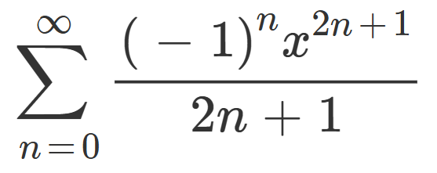

# Pi Estimation Using Threads & Processes


This project demonstrates different implementations to estimate the value of π using the Maclaurin series. The project includes four distinct versions:

1. **Sequential (`sequential.c`)**  
   A basic single-threaded implementation.

2. **Multithreaded (`multithreaded.c`)**  
   Uses POSIX threads (`pthread`) along with a custom spinlock for parallel computation.

3. **Multiprocessed (Shared Memory) (`multiprocessed_shared_memory.c`)**  
   Utilizes `fork()` and shared memory via `mmap()` with a spinlock to synchronize access.

4. **Multiprocessed (Pipes) (`multiprocessed_pipes.c`)**  
   Leverages `fork()` and pipes for inter-process communication.


## Compilation

Use the following commands to compile each version:

### Sequential Version
```sh
gcc -o pi_sequential sequential.c common/maclaurin/maclaurin.c -lm
gcc -o pi_multithreaded multithreaded.c common/locks/locks.c common/maclaurin/maclaurin.c -lpthread -lm
gcc -o pi_multiprocess_shm multiprocessed_shared_memory.c common/locks/locks.c common/maclaurin/maclaurin.c -lrt -lm
gcc -o pi_multiprocess_pipes multiprocessed_pipes.c common/maclaurin/maclaurin.c -lm
```
## Usage
Replace <number_of_terms> or <number_of_threads/processes> with your desired values:

```sh 
./pi_sequential <number_of_terms>
./pi_multithreaded <number_of_threads> <number_of_terms>
./pi_multiprocess_shm <number_of_processes> <number_of_terms>
./pi_multiprocess_pipes <number_of_processes> <number_of_terms>
```

## License
This project is licensed under the MIT License.